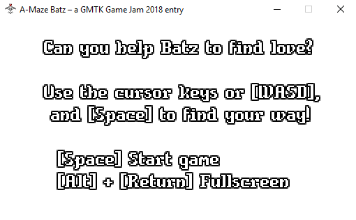

# A-Maze Batz

*A small casual game entry for the [Game Maker's Toolkit Game Jam 2018](https://itch.io/jam/gmtk-2018).*

© 2018 Mario Liebisch <mario.liebisch@gmail.com>

## About the Game

You're helping **Batz** on his way through dark and deep caverns on the look for the one thing that really matters: **Batsie**. This must be true bat love in some way, although Batsie seems to leave our hero from time to time and he'll have to find her once again.

 There's no real end: Once the last level has been beaten, the game will simply restart from the first one. You can even create your own levels and challenge your friends to find Batsie as fast as possible.

You can't really lose the game. There are no lives, there's no timer. Some kind of time attack mode was planned, but I was lacking time so far. In its current form, consider this a prototype and proof of concept.

**This project originated in a game jam weekend in a total of less than 24 hours.** This code isn't clean and it's clearly not built around best practices and optimization only. If you're curious, have a look, but always keep this in mind.

## Controls

The game controls are pretty straight forward:

* **Cursor Keys** and **W/A/S/D**: Steer Batz through the dark saves.
* **Space**: Use Batz's sonar to identify caverns, tunnels and openings. Batsie will also answer your call, if she can hear you.

## Building the Game

To build the game, you'll need a recent version of [CMake](https://cmake.org/) as well as [SFML](https://sfml-dev.org/) and an up-to-date C/C++ toolchain (like GCC, MinGW, Visual Studio, etc.).

To configure and build the project, just run CMake in the usual way: `cmake path/to/source`.

You might have to specify to your SFML installation: `cmake -DSFML_DIR=C:/Code/SFML/lib/cmake/SFML path/to/source` (note the sub path pointing inside the installation directory).

## License

This game is released under the [MIT License](LICENSE). Feel free to use all or portions of it in your own projects. If you finish some cool project, I'd love to hear about it!

## Modding and Level Editing

The game's levels are stored in a very simple and easy to edit way. Open the sub directory `assets/levels`, where you'll find one PNG image per level.

You can edit existing levels or create new ones, simply creating a new file following the existing numbering pattern. If the last level is `level5.png`, save your own level as `level6.png` to extend the game. There's no need to recompile or rebuild the game in order to test new levels.

There are a few tiny things to keep in mind here:

* Your PNG file has to be saved as an 24-bit or 32-bit color PNG image. 8-bit PNGs are not supported.
* Fully black parts (RGB: 0/0/0) are considered solid. You don't have to fill shapes. Even 1 pixel thin lines should count, although sonar pings might pass through thin diagonal lines.
* Make sure that tunnels and choke points are at least 10-12 pixels wide.
* Green pixels (RGB: 0/255/0) are potential starting positions. If there's more than one position available, the actual starting position will be picked at random.
* Red pixels (RGB: 255/0/0) are potential goal positions, i.e. where Batsie may be found.
* Blue pixels (RGB: 0/0/255) create random water drops that will be visible.